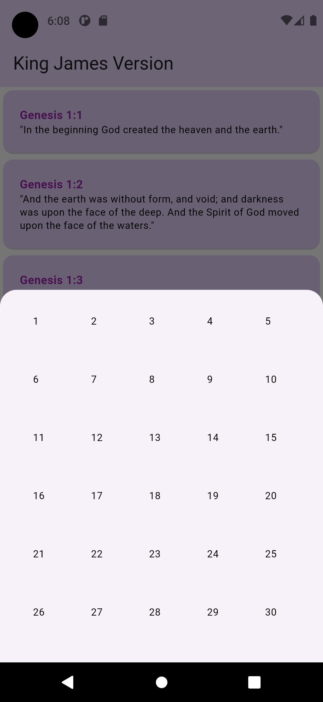
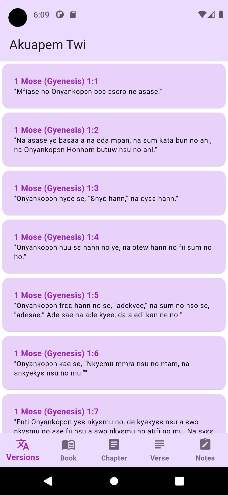

# Simple Bible 📖

Welcome to Simple Bible, your go-to Flutter project for a user-friendly and feature-rich Bible app. Dive into the world of scripture with ease, taking advantage of our multilingual support, multi-version options, note-taking capabilities, and more.

## Overview 🌟

Download the latest release of Simple Bible APK and start exploring the Bible effortlessly:
[Download Simple Bible APK](./.readme/simple_bible.apk)

## Requirements 🛠️

Ensure your environment meets the following requirements to run Simple Bible:

- Flutter SDK installed
- Dart SDK installed
- Android Studio / VS Code with Flutter plugin
- Minimum API Level: 16 (Jelly Bean)

## Features 🚀

- **Multilingual Support:** Read the Bible in Akuapem Twi and English.
- **Multiversion Support:** Choose between KJV and Akuapem Twi versions.
- **Note-taking:** Jot down your thoughts and insights as you read.
- **Light and Dark Theme:** Personalize your reading experience.
- **Intuitive UX:** Navigate the app seamlessly for an enjoyable experience.

## Screenshots 📸

| Light Theme | Dark Theme |
|-------------|------------|
|  |  |
|  |  |
|  |  |
|  |  |
|  |  |
|  |  |
|  |  |

## Authors 🤝

Meet the minds behind Simple Bible:

- [Jeffrey Boahen 🔥](https://github.com/yellow-Flickr)
- [Collins Brobbey 🤓](https://github.com/Qweku)

Feel free to contribute, report issues, or suggest improvements. Happy reading! 📚✨
